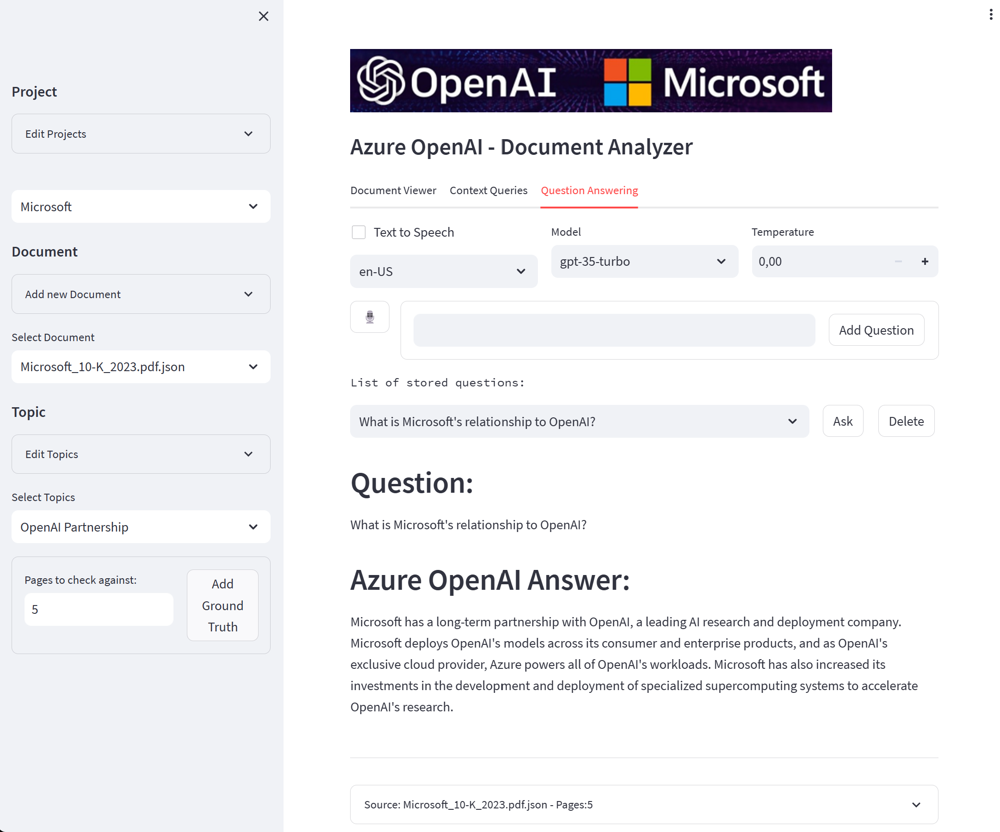

# OpenAI Document Analyzer

## Introduction
This demo application was built to show how Azure AI Document Intelligence and Azure OpenAI Service can be used to increase the efficiency of document analysis.

You can create a new project and upload your pdf-documents to it. The documents will be analyzed with Azure AI Document Intelligence and the results will be stored in the project folder.

A FAISS Vector Search Index will be created for the documents and you can use similarity search to find relevant content in the documents and create a reduced version of the content to reduce the human effort for reading.

Tables and Key Value pairs that are found in the documents will be extracted and can also be viewed with the click of a button.

The reduced version of the content (a markdown version of all pages where similarity search found relevant content) can be used as context to ask questions about the documents with Azure OpenAI ("gpt-35-turbo")

The application also provides Speech to text and Text to Speech functionality to increase accessibility (currently English and German)

Questions and Queries are stored in the topics subfolder of the project, so that you can easily reuse them i.e. for quantitative prompt testing with prompt flow.

For a good demonstration I suggest you import a set of documents and include information (topics) that you try to find in the documents and the pages that humans would normally look at to gather the information.

These pages can be used to set the ground truth for the topic. If the ground truth is set, the application will notify you if the pages that were found by the similarity search are part of the ground truth or not.

Based on the k value you can increase the likelyhood to find the relevant pages, but you will also increase the number of pages that are not relevant, so that the efficiency gain will be reduced.

However this is a great way to demonstrate the impact of proper prompts and k values on the results.

## Prerequisites:
- Azure Subscription with the following resources:
  - Azure AI Document Intelligence (S0 tier)
  - Azure OpenAI
  - Azure AI Speech
 
In the [Azure OpenAI Studio](https://oai.azure.com/portal) deploy the following models and make sure the name of the deployment is the same as mentioned below:
- gpt-35-turbo
- text-embedding-ada-002

You can find general information about Azure OpenAI [here](https://learn.microsoft.com/en-us/training/modules/explore-azure-openai/)

create a .env file and add the corresponding keys and endpoint information to the file (see .env.example for an example)

## Installation:
I suggest to use conda to create a a virtual python environment 

### Miniconda (example)
Install Miniconda according to the official documentation. (select add to PATH variable during installation)
https://conda.io/en/latest/miniconda.html

In your explorer navigate to the analyzer directory and rightclick
select open with conda prompt and in the prompt enter:

    conda create --name document_analyzer python=3.11

### Install the required packages:
In your explorer navigate to the analyzer directory and rightclick and open a command prompt terminal

    conda activate document_analyzer

Install the required packages with the following command:

    pip install -r requirements.txt

## Running the application:
In your explorer navigate to the analyzer directory and rightclick and open a command prompt terminal

    conda activate document_analyzer

Run the application with the following command:

    streamlit run document_analyzer.py

The application will open in a webrowser window at http://localhost:8501/

## Setup:
### Project
You start by first creating a new project which will create a new folder in the projects folder.
If you put a logo.png file inside of the project folder it will be used as the logo in the application. otherwise the default logo (img.png) will be used

### Documents
Now you can upload your documents to the project.
After that you can start the analysis with Azure AI Document Intelligence.
Depending on the length of the document, the analysis can take several minutes.
When the Analysis is finished, multiple JSON and md files are created inside the files subfolder of your project:
- *.json: contains the raw output of the analysis
- *.md: contains the full text of the document in markdown format
- *.pagecontent.json: contains the content of the pages in markdown format with the page number as the json key
- *.tables.md: contains the tables in markdown format
- *.keyvalues.json: contains the key values in json format with the page number as the json key

#### Chunks
Based on the anaysis results from Document Intelligence the paragraphs are used to chunk the document into smaller pieces:
The paragraphes wit sectionHeading role will be used to decide how to split the text. If the sections are larger than the token limit (default 512) the section will be split into smaller chunks.

### Topics
Now you can create topics which will create a new folder in the topics subfolder of your project.
Inside of the topic folder there are different text files:
- queries.txt: contains the queries that you want to use for the Vector Search
- questions.txt: contains the questions that you want to ask about the topic
- ground_truth.txt: contains the pages that humans would look at to answer the questions  (for ground truth checking)

## Usage
### Sidebar
on the sidebar you can select the project and the document that you want to analyze.
Now you can create or select a topic.

### Document Viewer
On the Document viewer tab you can view the document (Page range or Full), the extracted tables and key values.

### Context Query
On the Context Query tab you can enter a query and the application will search for the most relevant pages and display the content of the pages that are most relevant to the query. This is also the context that is used on the Question Answering tab.

### Question Answering
The Question Answering tab allows you to ask questions about the context using gpt-3-turbo from Azure Open AI.

## Support
The application is provided as is without any support.
Feel free to use it as a starting point for your own application.
